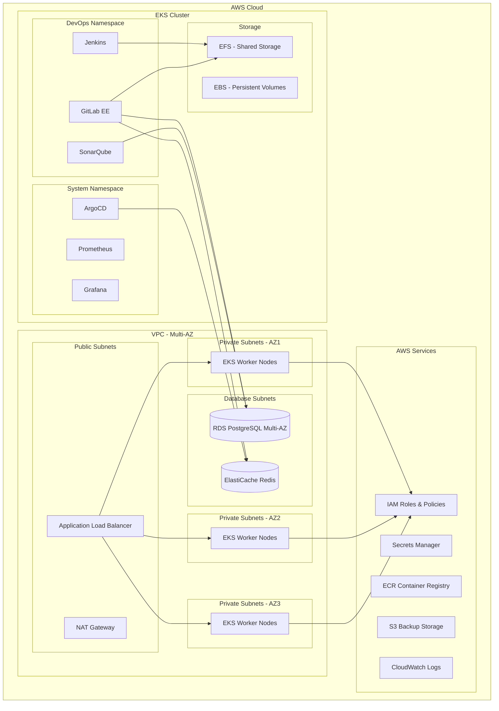

# 企業級 DevOps 平台設計文件

## 概述

本設計文件詳細描述了從 EC2 架構遷移到基於 AWS EKS 的現代化 DevOps 平台的技術架構。新平台採用雲原生技術棧，整合 GitLab EE、Grafana、SonarQube、Jenkins 和 ArgoCD，實現完整的 GitOps 工作流程，並確保符合企業的安全、合規和高可用性要求。

## 架構

### 整體架構圖



### 網路架構

- **VPC 設計**: 跨三個可用區的多層網路架構
- **公有子網**: 部署 Application Load Balancer 和 NAT Gateway
- **私有子網**: 部署 EKS Worker Nodes，確保安全隔離
- **資料庫子網**: 獨立子網部署 RDS 和 ElastiCache
- **安全群組**: 最小權限原則，僅開放必要端口

### 高可用性設計

- **多可用區部署**: 所有關鍵組件跨三個 AZ 部署
- **自動擴展**: EKS 節點群組配置 Cluster Autoscaler
- **負載均衡**: ALB 分散流量到多個 Worker Nodes
- **資料庫高可用**: RDS Multi-AZ 部署，自動故障轉移

## 組件和介面

### 1. EKS 集群基礎設施

#### 技術規格
- **Kubernetes 版本**: 1.28 (最新穩定版)
- **節點群組配置**:
  - 系統節點群組: t3.medium (2-5 節點)
  - 應用節點群組: m5.large (3-10 節點)
  - 高記憶體節點群組: r5.xlarge (1-3 節點，用於 SonarQube)

#### 網路配置
```yaml
# EKS 網路配置
apiVersion: v1
kind: ConfigMap
metadata:
  name: aws-auth
data:
  mapRoles: |
    - rolearn: arn:aws:iam::ACCOUNT:role/EKSNodeInstanceRole
      username: system:node:{{EC2PrivateDNSName}}
      groups:
        - system:bootstrappers
        - system:nodes
```

#### 儲存類別
```yaml
apiVersion: storage.k8s.io/v1
kind: StorageClass
metadata:
  name: gp3-encrypted
provisioner: ebs.csi.aws.com
parameters:
  type: gp3
  encrypted: "true"
  fsType: ext4
allowVolumeExpansion: true
volumeBindingMode: WaitForFirstConsumer
```

### 2. GitLab Enterprise Edition

#### 部署架構
- **Helm Chart**: 使用官方 GitLab Helm Chart
- **高可用配置**: 多副本部署，共享儲存
- **資料庫**: 外部 RDS PostgreSQL
- **快取**: 外部 ElastiCache Redis

#### 配置範例
```yaml
# GitLab Helm Values
global:
  edition: ee
  hosts:
    domain: devops.company.com
  ingress:
    configureCertmanager: true
    class: alb
  psql:
    host: gitlab-postgres.region.rds.amazonaws.com
    database: gitlab
    username: gitlab
  redis:
    host: gitlab-redis.cache.amazonaws.com

gitlab:
  webservice:
    replicaCount: 3
    resources:
      requests:
        cpu: 1000m
        memory: 2Gi
      limits:
        cpu: 2000m
        memory: 4Gi
```

#### 備份策略
- **每日自動備份**: 使用 GitLab Backup 工具
- **備份儲存**: S3 跨區域複製
- **保留政策**: 30 天本地，90 天遠端

### 3. Grafana 監控系統

#### 監控堆疊
- **Prometheus**: 指標收集和儲存
- **Grafana**: 視覺化和儀表板
- **AlertManager**: 警報管理
- **Node Exporter**: 節點指標
- **kube-state-metrics**: Kubernetes 指標

#### 部署配置
```yaml
# Prometheus 配置
apiVersion: v1
kind: ConfigMap
metadata:
  name: prometheus-config
data:
  prometheus.yml: |
    global:
      scrape_interval: 15s
      evaluation_interval: 15s
    
    rule_files:
      - "/etc/prometheus/rules/*.yml"
    
    scrape_configs:
      - job_name: 'kubernetes-apiservers'
        kubernetes_sd_configs:
          - role: endpoints
        scheme: https
        tls_config:
          ca_file: /var/run/secrets/kubernetes.io/serviceaccount/ca.crt
        bearer_token_file: /var/run/secrets/kubernetes.io/serviceaccount/token
```

#### 儀表板設計
- **基礎設施監控**: CPU、記憶體、磁碟、網路
- **Kubernetes 監控**: Pod、Service、Deployment 狀態
- **應用程式監控**: GitLab、Jenkins、SonarQube 指標
- **業務指標**: 建置成功率、部署頻率、MTTR

### 4. SonarQube 遷移

#### 容器化配置
```yaml
apiVersion: apps/v1
kind: Deployment
metadata:
  name: sonarqube
spec:
  replicas: 1
  selector:
    matchLabels:
      app: sonarqube
  template:
    metadata:
      labels:
        app: sonarqube
    spec:
      containers:
      - name: sonarqube
        image: sonarqube:9.9-community
        ports:
        - containerPort: 9000
        env:
        - name: SONAR_JDBC_URL
          value: "jdbc:postgresql://sonar-postgres.region.rds.amazonaws.com:5432/sonar"
        - name: SONAR_JDBC_USERNAME
          valueFrom:
            secretKeyRef:
              name: sonar-db-secret
              key: username
        resources:
          requests:
            cpu: 1000m
            memory: 4Gi
          limits:
            cpu: 2000m
            memory: 8Gi
```

#### 資料遷移策略
1. **資料庫備份**: 從現有 EC2 SonarQube 匯出資料
2. **RDS 還原**: 將資料匯入新的 RDS PostgreSQL
3. **配置遷移**: 轉換專案設定和品質規則
4. **驗證測試**: 確保歷史資料完整性

### 5. Jenkins 容器化

#### Kubernetes 原生部署
```yaml
apiVersion: apps/v1
kind: Deployment
metadata:
  name: jenkins-master
spec:
  replicas: 1
  selector:
    matchLabels:
      app: jenkins-master
  template:
    spec:
      containers:
      - name: jenkins
        image: jenkins/jenkins:lts
        ports:
        - containerPort: 8080
        - containerPort: 50000
        volumeMounts:
        - name: jenkins-home
          mountPath: /var/jenkins_home
        env:
        - name: JAVA_OPTS
          value: "-Xmx2048m -Dhudson.slaves.NodeProvisioner.initialDelay=0"
      volumes:
      - name: jenkins-home
        persistentVolumeClaim:
          claimName: jenkins-pvc
```

#### 動態 Agent 配置
```yaml
# Jenkins Kubernetes Plugin 配置
apiVersion: v1
kind: ConfigMap
metadata:
  name: jenkins-kubernetes-config
data:
  config.xml: |
    <org.csanchez.jenkins.plugins.kubernetes.KubernetesCloud>
      <name>kubernetes</name>
      <serverUrl>https://kubernetes.default</serverUrl>
      <namespace>devops</namespace>
      <jenkinsUrl>http://jenkins-master:8080</jenkinsUrl>
      <jenkinsTunnel>jenkins-master:50000</jenkinsTunnel>
      <containerCapStr>100</containerCapStr>
      <maxRequestsPerHostStr>32</maxRequestsPerHostStr>
    </org.csanchez.jenkins.plugins.kubernetes.KubernetesCloud>
```

### 6. ArgoCD GitOps

#### 高可用部署
```yaml
apiVersion: argoproj.io/v1alpha1
kind: ArgoCD
metadata:
  name: argocd
spec:
  server:
    replicas: 3
    ingress:
      enabled: true
      ingressClassName: alb
    config:
      url: https://argocd.devops.company.com
  
  controller:
    replicas: 3
  
  repoServer:
    replicas: 3
  
  redis:
    enabled: false
  
  externalRedis:
    host: argocd-redis.cache.amazonaws.com
    port: 6379
```

#### 應用程式管理
```yaml
# Application of Applications 模式
apiVersion: argoproj.io/v1alpha1
kind: Application
metadata:
  name: devops-platform
spec:
  project: default
  source:
    repoURL: https://gitlab.devops.company.com/platform/k8s-manifests
    targetRevision: main
    path: applications
  destination:
    server: https://kubernetes.default.svc
    namespace: argocd
  syncPolicy:
    automated:
      prune: true
      selfHeal: true
```

## 資料模型

### 1. 配置管理資料模型

#### Terraform 狀態管理
```hcl
# Backend 配置
terraform {
  backend "s3" {
    bucket         = "company-terraform-state"
    key            = "devops-platform/terraform.tfstate"
    region         = "us-west-2"
    encrypt        = true
    dynamodb_table = "terraform-locks"
  }
}
```

#### 環境變數管理
```yaml
# ConfigMap 結構
apiVersion: v1
kind: ConfigMap
metadata:
  name: platform-config
data:
  # 共用配置
  CLUSTER_NAME: "devops-eks-cluster"
  AWS_REGION: "us-west-2"
  DOMAIN_NAME: "devops.company.com"
  
  # 應用程式配置
  GITLAB_URL: "https://gitlab.devops.company.com"
  JENKINS_URL: "https://jenkins.devops.company.com"
  SONAR_URL: "https://sonar.devops.company.com"
  GRAFANA_URL: "https://grafana.devops.company.com"
```

### 2. 機密資訊管理

#### AWS Secrets Manager 整合
```yaml
# External Secrets Operator 配置
apiVersion: external-secrets.io/v1beta1
kind: SecretStore
metadata:
  name: aws-secrets-manager
spec:
  provider:
    aws:
      service: SecretsManager
      region: us-west-2
      auth:
        jwt:
          serviceAccountRef:
            name: external-secrets-sa
```

#### Kubernetes Secrets 結構
```yaml
# 資料庫連線機密
apiVersion: v1
kind: Secret
metadata:
  name: database-credentials
type: Opaque
data:
  gitlab-db-password: <base64-encoded>
  sonar-db-password: <base64-encoded>
  redis-password: <base64-encoded>
```

## 錯誤處理

### 1. 應用程式層級錯誤處理

#### 重試機制
```yaml
# ArgoCD 同步重試配置
apiVersion: argoproj.io/v1alpha1
kind: Application
spec:
  syncPolicy:
    retry:
      limit: 5
      backoff:
        duration: 5s
        factor: 2
        maxDuration: 3m
```

#### 健康檢查
```yaml
# Jenkins 健康檢查
apiVersion: v1
kind: Pod
spec:
  containers:
  - name: jenkins
    livenessProbe:
      httpGet:
        path: /login
        port: 8080
      initialDelaySeconds: 60
      periodSeconds: 30
      timeoutSeconds: 10
      failureThreshold: 3
    readinessProbe:
      httpGet:
        path: /login
        port: 8080
      initialDelaySeconds: 30
      periodSeconds: 10
```

### 2. 基礎設施層級錯誤處理

#### 自動修復機制
```yaml
# Pod Disruption Budget
apiVersion: policy/v1
kind: PodDisruptionBudget
metadata:
  name: gitlab-pdb
spec:
  minAvailable: 2
  selector:
    matchLabels:
      app: gitlab-webservice
```

#### 資源限制和配額
```yaml
# 命名空間資源配額
apiVersion: v1
kind: ResourceQuota
metadata:
  name: devops-quota
spec:
  hard:
    requests.cpu: "20"
    requests.memory: 40Gi
    limits.cpu: "40"
    limits.memory: 80Gi
    persistentvolumeclaims: "20"
```

## 測試策略

### 1. 基礎設施測試

#### Terraform 測試
```hcl
# Terratest 範例
func TestEKSCluster(t *testing.T) {
    terraformOptions := &terraform.Options{
        TerraformDir: "../terraform",
        Vars: map[string]interface{}{
            "cluster_name": "test-eks-cluster",
            "region":       "us-west-2",
        },
    }
    
    defer terraform.Destroy(t, terraformOptions)
    terraform.InitAndApply(t, terraformOptions)
    
    // 驗證 EKS 集群
    clusterName := terraform.Output(t, terraformOptions, "cluster_name")
    assert.Equal(t, "test-eks-cluster", clusterName)
}
```

#### Kubernetes 資源驗證
```bash
#!/bin/bash
# 健康檢查腳本
set -e

echo "檢查 EKS 集群狀態..."
kubectl cluster-info

echo "檢查節點狀態..."
kubectl get nodes

echo "檢查 Pod 狀態..."
kubectl get pods --all-namespaces

echo "檢查服務狀態..."
kubectl get services --all-namespaces
```

### 2. 應用程式整合測試

#### GitLab CI 測試流程
```yaml
# .gitlab-ci.yml
stages:
  - test
  - build
  - deploy

unit-test:
  stage: test
  script:
    - echo "執行單元測試"
    - npm test

sonar-scan:
  stage: test
  script:
    - sonar-scanner -Dsonar.projectKey=test-project

build-image:
  stage: build
  script:
    - docker build -t $CI_REGISTRY_IMAGE:$CI_COMMIT_SHA .
    - docker push $CI_REGISTRY_IMAGE:$CI_COMMIT_SHA

deploy-staging:
  stage: deploy
  script:
    - kubectl apply -f k8s/staging/
  environment:
    name: staging
```

### 3. 災難復原測試

#### 自動化測試腳本
```bash
#!/bin/bash
# 災難復原測試
set -e

echo "開始災難復原測試..."

# 模擬節點故障
echo "模擬節點故障..."
kubectl drain node-1 --ignore-daemonsets --delete-emptydir-data

# 檢查 Pod 重新調度
echo "檢查 Pod 重新調度..."
kubectl get pods -o wide

# 模擬資料庫故障轉移
echo "測試 RDS 故障轉移..."
aws rds reboot-db-instance --db-instance-identifier gitlab-postgres --force-failover

# 驗證服務可用性
echo "驗證服務可用性..."
curl -f https://gitlab.devops.company.com/health
curl -f https://jenkins.devops.company.com/login
curl -f https://sonar.devops.company.com/api/system/status
```

## 安全原則

### 1. 網路安全

#### 網路政策
```yaml
# 限制命名空間間通訊
apiVersion: networking.k8s.io/v1
kind: NetworkPolicy
metadata:
  name: deny-all-ingress
  namespace: devops
spec:
  podSelector: {}
  policyTypes:
  - Ingress
  ingress:
  - from:
    - namespaceSelector:
        matchLabels:
          name: system
    - podSelector:
        matchLabels:
          app: allowed-app
```

#### 服務網格安全 (Istio)
```yaml
# 服務間 mTLS
apiVersion: security.istio.io/v1beta1
kind: PeerAuthentication
metadata:
  name: default
  namespace: devops
spec:
  mtls:
    mode: STRICT
```

### 2. 身份驗證和授權

#### RBAC 配置
```yaml
# DevOps 團隊角色
apiVersion: rbac.authorization.k8s.io/v1
kind: Role
metadata:
  namespace: devops
  name: devops-admin
rules:
- apiGroups: [""]
  resources: ["*"]
  verbs: ["*"]
- apiGroups: ["apps"]
  resources: ["*"]
  verbs: ["*"]

---
apiVersion: rbac.authorization.k8s.io/v1
kind: RoleBinding
metadata:
  name: devops-admin-binding
  namespace: devops
subjects:
- kind: User
  name: devops-team
  apiGroup: rbac.authorization.k8s.io
roleRef:
  kind: Role
  name: devops-admin
  apiGroup: rbac.authorization.k8s.io
```

#### Pod Security Standards
```yaml
# Pod 安全政策
apiVersion: v1
kind: Namespace
metadata:
  name: devops
  labels:
    pod-security.kubernetes.io/enforce: restricted
    pod-security.kubernetes.io/audit: restricted
    pod-security.kubernetes.io/warn: restricted
```

### 3. 容器安全

#### 映像掃描
```yaml
# Trivy 掃描 Job
apiVersion: batch/v1
kind: Job
metadata:
  name: image-scan
spec:
  template:
    spec:
      containers:
      - name: trivy
        image: aquasec/trivy:latest
        command:
        - trivy
        - image
        - --exit-code
        - "1"
        - --severity
        - HIGH,CRITICAL
        - jenkins/jenkins:lts
      restartPolicy: Never
```

## 監控與警報

### 1. 基礎設施監控

#### Prometheus 規則
```yaml
# 高 CPU 使用率警報
groups:
- name: infrastructure
  rules:
  - alert: HighCPUUsage
    expr: 100 - (avg by(instance) (irate(node_cpu_seconds_total{mode="idle"}[5m])) * 100) > 80
    for: 5m
    labels:
      severity: warning
    annotations:
      summary: "高 CPU 使用率"
      description: "節點 {{ $labels.instance }} CPU 使用率超過 80%"

  - alert: PodCrashLooping
    expr: rate(kube_pod_container_status_restarts_total[15m]) > 0
    for: 5m
    labels:
      severity: critical
    annotations:
      summary: "Pod 重啟循環"
      description: "Pod {{ $labels.pod }} 在命名空間 {{ $labels.namespace }} 中持續重啟"
```

#### Grafana 儀表板
```json
{
  "dashboard": {
    "title": "DevOps Platform Overview",
    "panels": [
      {
        "title": "Cluster Resource Usage",
        "type": "stat",
        "targets": [
          {
            "expr": "sum(kube_node_status_allocatable{resource=\"cpu\"})",
            "legendFormat": "Total CPU"
          }
        ]
      },
      {
        "title": "Application Health",
        "type": "table",
        "targets": [
          {
            "expr": "up{job=~\"gitlab|jenkins|sonarqube\"}",
            "legendFormat": "{{ job }}"
          }
        ]
      }
    ]
  }
}
```

### 2. 應用程式監控

#### 自定義指標
```yaml
# GitLab 指標收集
apiVersion: v1
kind: Service
metadata:
  name: gitlab-metrics
  labels:
    app: gitlab
  annotations:
    prometheus.io/scrape: "true"
    prometheus.io/port: "9168"
spec:
  ports:
  - port: 9168
    name: metrics
  selector:
    app: gitlab
```

#### 警報通知
```yaml
# AlertManager 配置
global:
  slack_api_url: 'https://hooks.slack.com/services/YOUR/SLACK/WEBHOOK'

route:
  group_by: ['alertname']
  group_wait: 10s
  group_interval: 10s
  repeat_interval: 1h
  receiver: 'web.hook'

receivers:
- name: 'web.hook'
  slack_configs:
  - channel: '#devops-alerts'
    title: 'DevOps Platform Alert'
    text: '{{ range .Alerts }}{{ .Annotations.description }}{{ end }}'
```

## 成本優化

### 1. 資源優化策略

#### 垂直 Pod 自動擴展
```yaml
# VPA 配置
apiVersion: autoscaling.k8s.io/v1
kind: VerticalPodAutoscaler
metadata:
  name: gitlab-vpa
spec:
  targetRef:
    apiVersion: apps/v1
    kind: Deployment
    name: gitlab-webservice
  updatePolicy:
    updateMode: "Auto"
  resourcePolicy:
    containerPolicies:
    - containerName: gitlab
      maxAllowed:
        cpu: 2
        memory: 4Gi
      minAllowed:
        cpu: 100m
        memory: 128Mi
```

#### 水平 Pod 自動擴展
```yaml
# HPA 配置
apiVersion: autoscaling/v2
kind: HorizontalPodAutoscaler
metadata:
  name: jenkins-hpa
spec:
  scaleTargetRef:
    apiVersion: apps/v1
    kind: Deployment
    name: jenkins-master
  minReplicas: 1
  maxReplicas: 5
  metrics:
  - type: Resource
    resource:
      name: cpu
      target:
        type: Utilization
        averageUtilization: 70
```

### 2. 成本監控

#### AWS Cost Explorer 整合
```python
# 成本監控腳本
import boto3
import datetime

def get_eks_costs():
    ce = boto3.client('ce')
    
    end_date = datetime.date.today()
    start_date = end_date - datetime.timedelta(days=30)
    
    response = ce.get_cost_and_usage(
        TimePeriod={
            'Start': start_date.strftime('%Y-%m-%d'),
            'End': end_date.strftime('%Y-%m-%d')
        },
        Granularity='DAILY',
        Metrics=['BlendedCost'],
        GroupBy=[
            {
                'Type': 'DIMENSION',
                'Key': 'SERVICE'
            }
        ],
        Filter={
            'Dimensions': {
                'Key': 'SERVICE',
                'Values': ['Amazon Elastic Kubernetes Service']
            }
        }
    )
    
    return response
```

## 災難復原

### 1. 備份策略

#### Velero 備份配置
```yaml
# Velero 備份排程
apiVersion: velero.io/v1
kind: Schedule
metadata:
  name: daily-backup
spec:
  schedule: "0 2 * * *"
  template:
    includedNamespaces:
    - devops
    - system
    storageLocation: aws-s3
    volumeSnapshotLocations:
    - aws-ebs
    ttl: 720h0m0s
```

#### 資料庫備份
```bash
#!/bin/bash
# RDS 自動備份腳本
set -e

TIMESTAMP=$(date +%Y%m%d_%H%M%S)
SNAPSHOT_ID="gitlab-postgres-backup-${TIMESTAMP}"

echo "建立 RDS 快照: ${SNAPSHOT_ID}"
aws rds create-db-snapshot \
    --db-instance-identifier gitlab-postgres \
    --db-snapshot-identifier ${SNAPSHOT_ID}

echo "等待快照完成..."
aws rds wait db-snapshot-completed \
    --db-snapshot-identifier ${SNAPSHOT_ID}

echo "複製快照到備用區域..."
aws rds copy-db-snapshot \
    --source-db-snapshot-identifier ${SNAPSHOT_ID} \
    --target-db-snapshot-identifier ${SNAPSHOT_ID}-dr \
    --source-region us-west-2 \
    --target-region us-east-1
```

### 2. 復原程序

#### 自動化復原腳本
```bash
#!/bin/bash
# 災難復原腳本
set -e

BACKUP_REGION="us-east-1"
PRIMARY_REGION="us-west-2"

echo "開始災難復原程序..."

# 1. 在備用區域建立 EKS 集群
echo "建立備用 EKS 集群..."
cd terraform/dr
terraform init
terraform apply -auto-approve

# 2. 還原資料庫
echo "還原 RDS 資料庫..."
aws rds restore-db-instance-from-db-snapshot \
    --db-instance-identifier gitlab-postgres-dr \
    --db-snapshot-identifier gitlab-postgres-backup-latest \
    --region ${BACKUP_REGION}

# 3. 部署應用程式
echo "部署應用程式到備用集群..."
kubectl config use-context dr-cluster
kubectl apply -f k8s/dr/

# 4. 更新 DNS 記錄
echo "更新 DNS 指向備用環境..."
aws route53 change-resource-record-sets \
    --hosted-zone-id Z123456789 \
    --change-batch file://dns-failover.json

echo "災難復原完成"
```

### 3. RTO/RPO 目標

#### 服務等級目標
- **RTO (Recovery Time Objective)**: 4 小時
- **RPO (Recovery Point Objective)**: 1 小時
- **可用性目標**: 99.9%
- **資料完整性**: 99.99%

#### 測試排程
```yaml
# 災難復原測試排程
apiVersion: batch/v1
kind: CronJob
metadata:
  name: dr-test
spec:
  schedule: "0 2 1 * *"  # 每月第一天凌晨 2 點
  jobTemplate:
    spec:
      template:
        spec:
          containers:
          - name: dr-test
            image: company/dr-test:latest
            command:
            - /bin/bash
            - -c
            - |
              echo "開始災難復原測試..."
              ./scripts/dr-test.sh
              echo "災難復原測試完成"
          restartPolicy: OnFailure
```

這個設計文件提供了完整的技術架構和實施細節，涵蓋了所有需求中提到的組件和非功能性要求。設計考慮了財星 500 強企業的安全、合規、高可用性和成本優化需求。